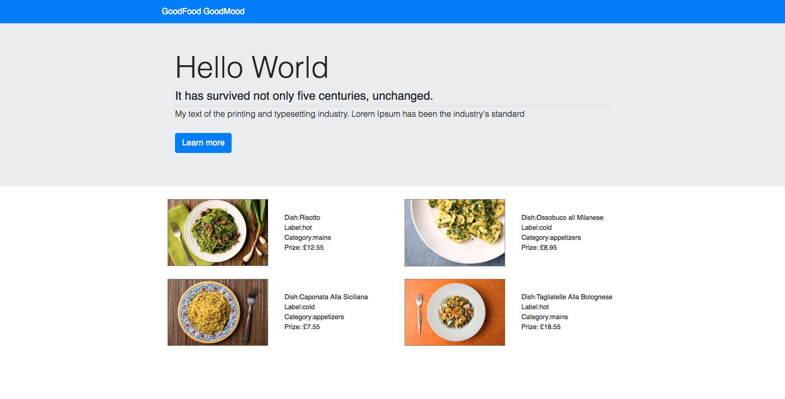

### con3-React

#### Components refactored for list/ details
- starts at main component serving as the container
  + constructor and state (dishes: DishData, selectedDish: null) .  Only Main comp
  
- 2 components:
  + Menu
  + Details
  
  + both imported from main
    & render jsx.
    For Menu, passed this.state.dishes and received handleDetails click event in Menu
    For Details, filter and check id to pass dish to details comp
    
- Menu render data via props and placed click evt for details

- Details imported from main, render directly to details
  + click handle in Menu pass in Jsx for details
  + setState main comp

  
  

  
 

 # con3-React
